# Claude Code Open 系统架构文档

> 生成日期: 2026-01-16  
> 版本: v2.1.7  
> 基于官方 Claude Code v2.1.4 逆向工程

## 文档概览

本文档详细描述了 claude-code-open 项目的系统架构设计,包括核心模块、数据流、工具系统、WebUI 架构以及蓝图(Blueprint)系统。

**目录**
1. [整体系统架构](#1-整体系统架构)
2. [双模式架构](#2-双模式架构-cli--webui)
3. [核心引擎层详解](#3-核心引擎层详解)
4. [工具系统架构](#4-工具系统架构)
5. [蓝图(Blueprint)系统](#5-蓝图blueprint系统架构)
6. [记忆系统架构](#6-统一记忆系统架构)
7. [流式处理详解](#7-流式输出处理)
8. [权限与安全](#8-权限系统架构)
9. [性能优化机制](#9-三层自动压缩机制)
10. [配置与扩展](#10-配置和环境变量)

---

## 1. 整体系统架构 (数据流图)

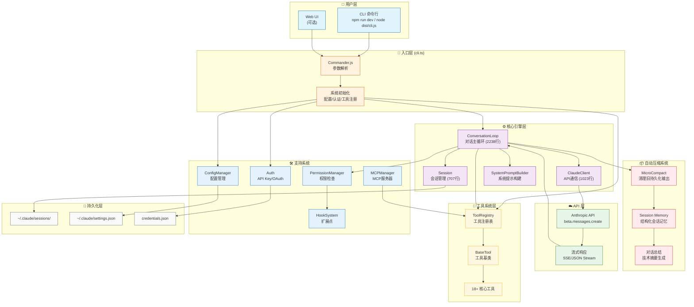

---

## 2. 流式输出处理 (信号序列图)

```mermaid
sequenceDiagram
    autonumber
    participant User as 👤 用户
    participant Loop as ConversationLoop
    participant Client as ClaudeClient
    participant API as Anthropic API
    participant Stream as StreamParser
    participant Tool as ToolRegistry

    User->>Loop: 输入消息
    activate Loop

    Loop->>Loop: MicroCompact 清理
    Loop->>Loop: AutoCompact 检查

    Loop->>Client: createMessageStream()
    activate Client

    Client->>API: POST /v1/messages (stream=true)
    activate API

    rect rgb(230, 245, 255)
        Note over API,Stream: 流式响应阶段
        API-->>Stream: message_start
        Stream-->>Loop: 消息开始信号

        loop 内容块循环
            API-->>Stream: content_block_start
            Note right of Stream: type: text/tool_use/thinking

            API-->>Stream: content_block_delta
            Note right of Stream: text_delta/input_json_delta/thinking_delta

            API-->>Stream: content_block_stop
            Stream-->>Loop: 内容块完成
        end

        API-->>Stream: message_delta
        Note right of Stream: stop_reason, usage

        API-->>Stream: message_stop
    end

    deactivate API
    deactivate Client

    alt 有工具调用
        Loop->>Tool: 执行工具
        activate Tool
        Tool->>Tool: 权限检查
        Tool-->>Loop: tool_result
        deactivate Tool
        Loop->>Loop: 继续循环
    else 无工具调用
        Loop-->>User: 返回响应
    end

    deactivate Loop
```

---

## 3. 流式事件类型详解

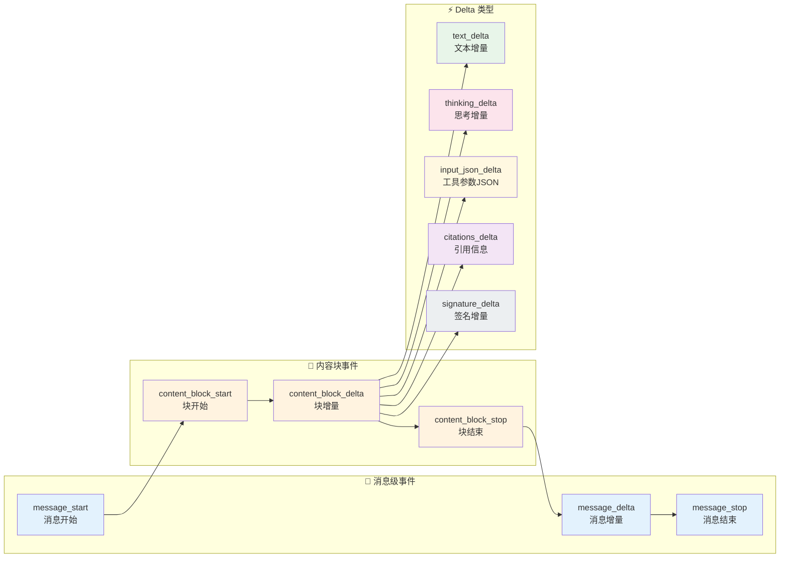

---

## 4. 工具调用流程

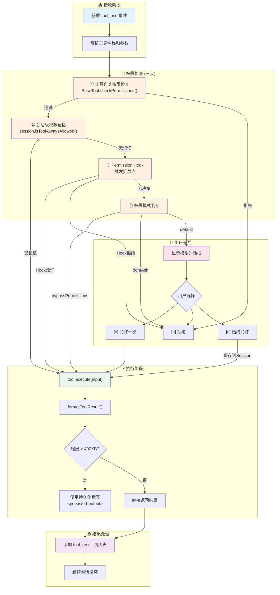

---

## 5. 三层自动压缩机制

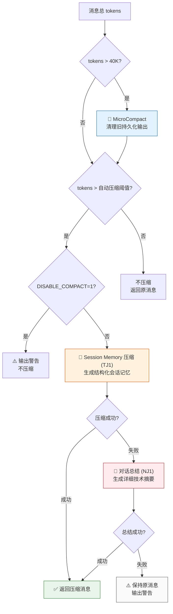

---

## 6. 工具系统架构

```mermaid
flowchart TB
    subgraph 工具注册表["📋 ToolRegistry"]
        Registry["ToolRegistry<br/>单例模式"]
    end

    subgraph 基类["🏗️ BaseTool"]
        Base["BaseTool<br/>抽象基类"]
        Methods["+ name: string<br/>+ description: string<br/>+ inputSchema: ZodSchema<br/>+ execute(input): Promise<br/>+ checkPermissions(): PermissionResult"]
    end

    subgraph 文件工具["📁 文件工具 (3个)"]
        Read["ReadTool<br/>文件读取"]
        Write["WriteTool<br/>文件写入"]
        Edit["EditTool<br/>文件编辑"]
    end

    subgraph 搜索工具["🔍 搜索工具 (3个)"]
        Bash["BashTool<br/>命令执行"]
        Glob["GlobTool<br/>文件匹配"]
        Grep["GrepTool<br/>内容搜索"]
    end

    subgraph Web工具["🌐 Web工具 (2个)"]
        Fetch["WebFetchTool<br/>网页获取"]
        Search["WebSearchTool<br/>网页搜索"]
    end

    subgraph 任务工具["📝 任务工具 (3个)"]
        Todo["TodoWriteTool<br/>待办管理"]
        Task["TaskTool<br/>子代理"]
        TaskOutput["TaskOutputTool<br/>获取输出"]
    end

    subgraph MCP工具["🔌 MCP工具 (3个)"]
        MCPSearch["MCPSearchTool"]
        ListMcp["ListMcpResourcesTool"]
        ReadMcp["ReadMcpResourceTool"]
    end

    subgraph 其他工具["🛠️ 其他工具 (4+个)"]
        Notebook["NotebookEditTool<br/>Jupyter编辑"]
        Skill["SkillTool<br/>技能系统"]
        LSP["LSPTool<br/>语言服务器"]
        Ask["AskUserQuestionTool<br/>用户交互"]
    end

    subgraph 计划工具["📐 计划工具 (2个)"]
        Enter["EnterPlanModeTool"]
        Exit["ExitPlanModeTool"]
    end

    Registry --> Base
    Base --> Methods

    Base --> Read
    Base --> Write
    Base --> Edit

    Base --> Bash
    Base --> Glob
    Base --> Grep

    Base --> Fetch
    Base --> Search

    Base --> Todo
    Base --> Task
    Base --> TaskOutput

    Base --> MCPSearch
    Base --> ListMcp
    Base --> ReadMcp

    Base --> Notebook
    Base --> Skill
    Base --> LSP
    Base --> Ask

    Base --> Enter
    Base --> Exit

    style Registry fill:#f3e5f5,stroke:#7b1fa2
    style Base fill:#e3f2fd,stroke:#1565c0
```

---

## 7. Agent 系统架构

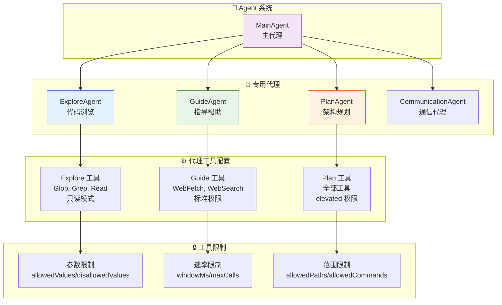

---

## 8. 权限系统架构

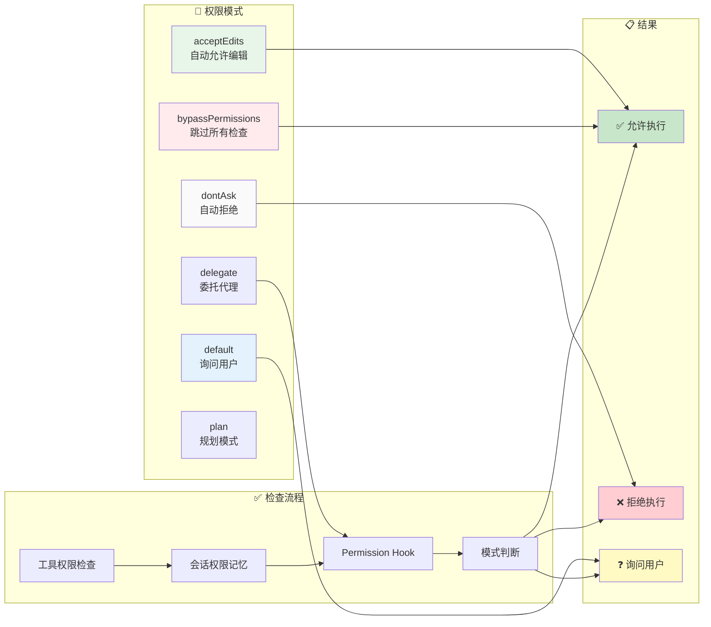

---

## 9. 模块间调用关系

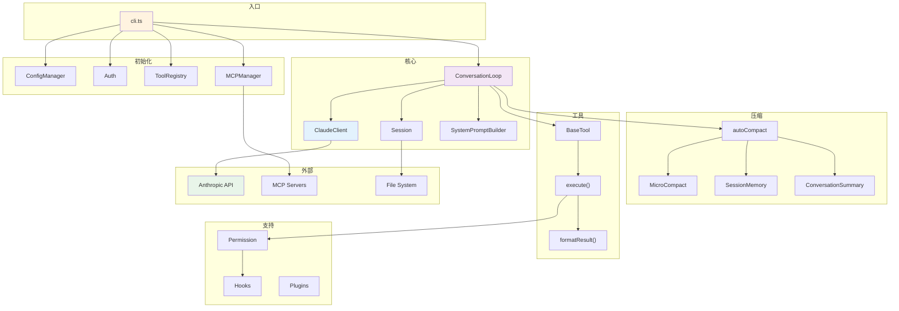

---

## 10. 消息结构

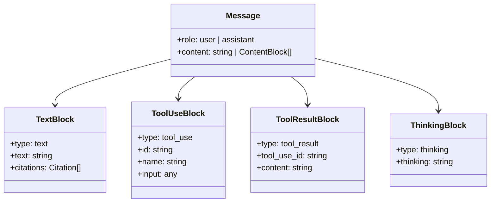

---

## 11. 完整数据流路径

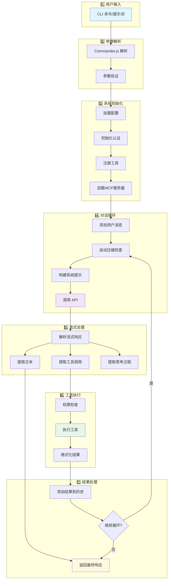

---

## 12. 配置和环境变量

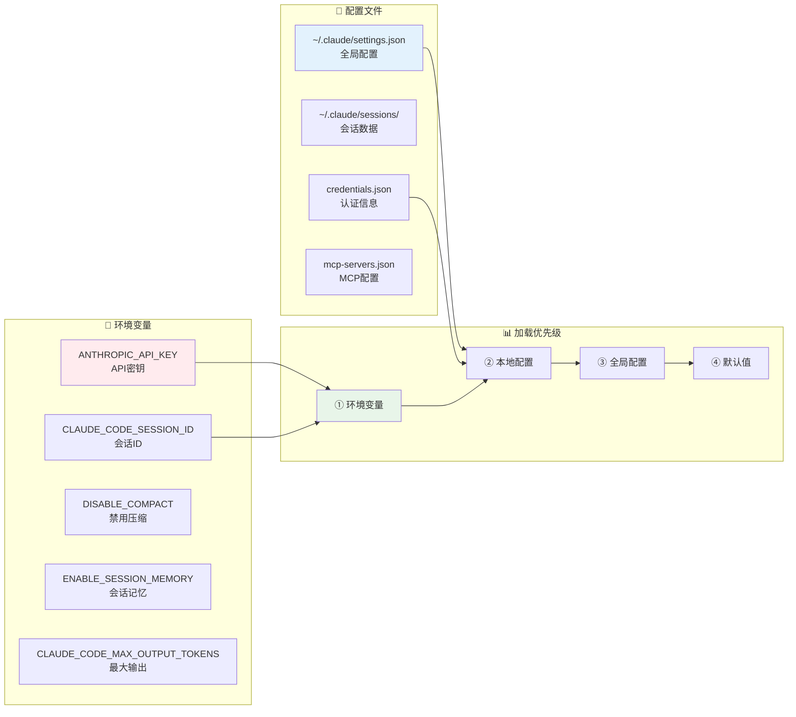

---

## 附录: 关键常量

| 常量 | 值 | 说明 |
|-----|-----|-----|
| `MICROCOMPACT_THRESHOLD` | 40K tokens | MicroCompact 触发阈值 |
| `MIN_SAVINGS_THRESHOLD` | 20K tokens | 最小节省阈值 |
| `KEEP_RECENT_COUNT` | 3 | 保留最近工具结果数 |
| `PERSIST_OUTPUT_THRESHOLD` | 400KB | 持久化输出阈值 |
| `PREVIEW_SIZE` | 2KB | 预览大小 |
| `MAX_OUTPUT_TOKENS` | 32K | 默认最大输出 |
| `CONTEXT_WINDOW` | 200K | 模型上下文窗口 |

---

> 本文档使用 Mermaid 语法，可在支持 Mermaid 的 Markdown 渲染器中查看（如 GitHub、VSCode、Typora 等）
