# API 配置功能实现总结

## ✅ 已完成的功能

### 1. 自定义 API 配置
- ✅ API Base URL（自定义端点）
- ✅ API Key（密钥认证）
- ✅ 自定义模型名称
- ✅ 认证优先级（auto/apiKey/oauth）

### 2. 测试连接功能 ⭐
- ✅ 前端测试按钮
- ✅ 后端测试 API 端点 (`POST /api/config/api/test`)
- ✅ 实时反馈（成功/失败消息）
- ✅ 使用 Haiku 模型进行低成本测试

### 3. 实际应用集成 🎯
- ✅ 修改 `src/providers/index.ts` 的 `createClient()` 函数
- ✅ 确保配置真正影响 Anthropic SDK 的初始化
- ✅ 从配置中读取 apiKey 和 baseURL
- ✅ 支持 authPriority 逻辑

## 🔧 核心修改

### 1. 前端 (`src/web/client/src/components/config/ApiConfigPanel.tsx`)
- 添加 4 个新配置字段
- 添加测试连接按钮和逻辑
- 添加成功/失败消息显示
- URL 格式验证

### 2. 后端配置服务 (`src/web/server/services/config-service.ts`)
- 扩展 `ApiConfig` 接口
- 更新 `getApiConfig()` 返回新字段
- 自动支持新字段的存储

### 3. 后端API路由 (`src/web/server/routes/config-api.ts`)
- 新增 `POST /api/config/api/test` 端点
- 创建临时 Anthropic 客户端进行测试
- 返回详细的测试结果

### 4. **核心集成** (`src/providers/index.ts`) ⭐⭐⭐
- 修改 `createClient()` 函数
- 优先使用配置中的 `apiKey` 和 `baseUrl`
- 确保用户配置的 API Key 真正起作用
- 支持环境变量 fallback

## 📝 配置流程

```mermaid
graph LR
    A[用户在UI配置] --> B[保存到ConfigManager]
    B --> C[createClient读取配置]
    C --> D[创建Anthropic客户端]
    D --> E[实际API调用使用配置]
```



## 🚀 使用示例

### 场景 1: 测试第三方 API
```typescript
// 用户在UI中配置
apiBaseUrl: "https://api.example.com"
apiKey: "sk-custom-key-12345"
customModelName: "claude-3-opus-20240229"
authPriority: "apiKey"

// 点击"测试连接"验证

// 保存后，createClient() 会使用这些配置
const client = new Anthropic({
  apiKey: "sk-custom-key-12345",
  baseURL: "https://api.example.com"
});
```

### 场景 2: 使用官方 API
```typescript
// 用户在UI中配置
apiBaseUrl: ""  // 留空
apiKey: "sk-ant-official-key"
authPriority: "auto"

// createClient() 会创建
const client = new Anthropic({
  apiKey: "sk-ant-official-key",
  baseURL: "https://api.anthropic.com"
});
```

## 🔍 测试验证

### 前端测试
1. 打开设置 → API Advanced
2. 填入 API Key
3. （可选）填入自定义 Base URL
4. 点击"测试连接"
5. 查看结果消息

### 后端测试
```bash
# 测试API端点
curl -X POST http://localhost:3000/api/config/api/test \
  -H "Content-Type: application/json" \
  -d '{
    "apiKey": "sk-ant-...",
    "apiBaseUrl": "https://api.anthropic.com",
    "customModelName": "claude-3-5-haiku-20241022"
  }'
```

## 🎯 核心保证

✅ **配置不仅仅是存储，而是真正应用到系统中**
- `createClient()` 函数已修改
- 优先读取配置中的 apiKey 和 baseUrl
- 所有 API 调用都会使用这些配置

✅ **测试功能验证配置有效性**
- 实际调用 Anthropic API
- 使用最便宜的 Haiku 模型
- 返回详细的成功/失败信息

## 📁 修改的文件汇总

1. `src/web/client/src/components/config/ApiConfigPanel.tsx` - 前端UI
2. `src/web/server/services/config-service.ts` - 配置服务
3. `src/web/server/routes/config-api.ts` - API路由（测试端点）
4. `src/providers/index.ts` - **核心** 客户端创建逻辑
5. `docs/api-advanced-settings.md` - 功能文档

## 🎉 完成状态

- [x] 添加配置UI
- [x] 添加测试按钮
- [x] 实现测试API端点
- [x] **修改实际使用配置的代码** ⭐
- [x] 确保配置真正起作用
- [x] 编写完整文档

## 下一步建议

1. **API Key 加密**: 在后端实现加密存储
2. **配置模板**: 提供常见第三方 API 的预设配置
3. **高级测试**: 支持测试特定模型和参数
4. **使用统计**: 跟踪不同配置的使用情况
