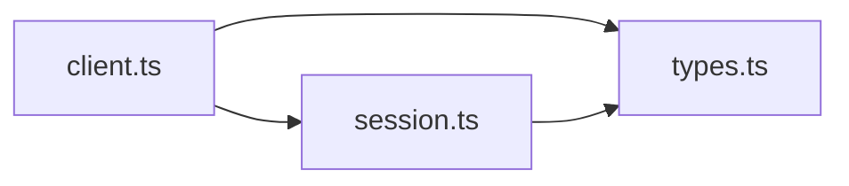

# 依赖图 API 文档

## 概述

依赖图 API 用于分析项目中模块之间的导入/导出关系，帮助开发者理解代码依赖结构。

## 端点

```
GET /api/blueprint/dependency-graph
```

## 查询参数

| 参数 | 类型 | 默认值 | 说明 |
|------|------|--------|------|
| `module` | string | (可选) | 要分析的模块路径。如果提供，只分析该模块及其依赖；否则分析整个项目 |
| `depth` | number | 3 | 依赖深度，控制向外扩展几层关系 |
| `includeTypeOnly` | boolean | false | 是否包含纯类型导入（TypeScript 的 `import type`） |

## 响应格式

```typescript
{
  success: boolean;
  data: {
    nodes: Array<{
      id: string;              // 模块标识符（相对路径）
      name: string;            // 文件名
      path: string;            // 绝对路径
      language: string;        // 编程语言（typescript/javascript）
      lines: number;           // 代码行数
      imports: Array<{         // 导入列表
        source: string;        // 导入来源
        symbols: string[];     // 导入的符号
        isDefault: boolean;    // 是否为默认导入
        isDynamic: boolean;    // 是否为动态导入
      }>;
      exports: Array<{         // 导出列表
        name: string;          // 导出名称
        type: 'default' | 'named' | 'namespace' | 'reexport';
      }>;
    }>;
    edges: Array<{
      source: string;          // 源模块 ID
      target: string;          // 目标模块 ID
      type: 'import' | 'require' | 'dynamic';
      symbols: string[];       // 导入的符号列表
      isTypeOnly: boolean;     // 是否仅类型导入
    }>;
    cycles?: string[][];       // 循环依赖列表（如果存在）
    stats: {
      totalEdges: number;      // 总边数
      internalDeps: number;    // 内部依赖数
      typeOnlyDeps: number;    // 纯类型依赖数
      dynamicDeps: number;     // 动态依赖数
      mostDependent: Array<{   // 依赖最多的模块
        id: string;
        count: number;
      }>;
      mostDepended: Array<{    // 被依赖最多的模块
        id: string;
        count: number;
      }>;
    };
  };
  metadata: {
    totalModules: number;      // 项目总模块数
    filteredModules: number;   // 过滤后模块数
    totalEdges: number;        // 总边数
    filteredEdges: number;     // 过滤后边数
    analysisTime: string;      // 分析时间（ISO 8601）
  };
}
```

## 使用示例

### 1. 分析整个项目的依赖关系

```bash
GET /api/blueprint/dependency-graph
```

### 2. 分析特定模块的依赖

```bash
GET /api/blueprint/dependency-graph?module=src/core/client.ts
```

### 3. 分析模块依赖（包含类型导入，深度为5）

```bash
GET /api/blueprint/dependency-graph?module=src/core/client.ts&depth=5&includeTypeOnly=true
```

## 响应示例

```json
{
  "success": true,
  "data": {
    "nodes": [
      {
        "id": "src/core/client.ts",
        "name": "client.ts",
        "path": "/project/src/core/client.ts",
        "language": "typescript",
        "lines": 342,
        "imports": [
          {
            "source": "./session",
            "symbols": ["Session"],
            "isDefault": false,
            "isDynamic": false
          },
          {
            "source": "@anthropic-ai/sdk",
            "symbols": ["Anthropic"],
            "isDefault": true,
            "isDynamic": false
          }
        ],
        "exports": [
          {
            "name": "ClaudeClient",
            "type": "named"
          }
        ]
      }
    ],
    "edges": [
      {
        "source": "src/core/client.ts",
        "target": "src/core/session.ts",
        "type": "import",
        "symbols": ["Session"],
        "isTypeOnly": false
      }
    ],
    "cycles": [
      ["src/module-a.ts", "src/module-b.ts", "src/module-a.ts"]
    ],
    "stats": {
      "totalEdges": 156,
      "internalDeps": 156,
      "typeOnlyDeps": 23,
      "dynamicDeps": 5,
      "mostDependent": [
        { "id": "src/core/client.ts", "count": 12 }
      ],
      "mostDepended": [
        { "id": "src/types.ts", "count": 45 }
      ]
    }
  },
  "metadata": {
    "totalModules": 234,
    "filteredModules": 15,
    "totalEdges": 567,
    "filteredEdges": 156,
    "analysisTime": "2026-01-10T12:34:56.789Z"
  }
}
```

## 错误处理

### 模块未找到（404）

```json
{
  "success": false,
  "error": "未找到模块: src/non-existent.ts"
}
```

### 服务器错误（500）

```json
{
  "success": false,
  "error": "Failed to parse module: Unexpected token"
}
```

## 性能考虑

- API 会限制分析的文件数量（最多 200 个文件），以避免响应时间过长
- 首次分析可能需要 5-30 秒，取决于项目大小
- 建议在分析大型项目时指定 `module` 参数，聚焦于特定模块

## 循环依赖检测

如果检测到循环依赖，会在 `data.cycles` 字段中返回。每个循环表示为一个模块 ID 数组：

```json
{
  "cycles": [
    [
      "src/module-a.ts",
      "src/module-b.ts",
      "src/module-c.ts",
      "src/module-a.ts"
    ]
  ]
}
```

## 可视化建议

依赖图数据可以使用以下可视化库进行展示：

- **D3.js** - 力导向图
- **vis.js** - 网络图
- **Cytoscape.js** - 复杂图谱可视化
- **Mermaid** - 文本化图表生成

示例 Mermaid 图：



## 相关 API

- `/api/blueprint/call-graph` - 函数调用图分析
- `/api/blueprint/analyze-node` - 单个文件/目录的语义分析
- `/api/blueprint/file-tree` - 文件树结构
